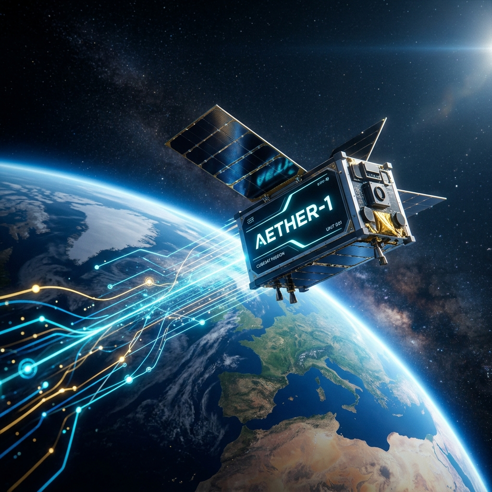
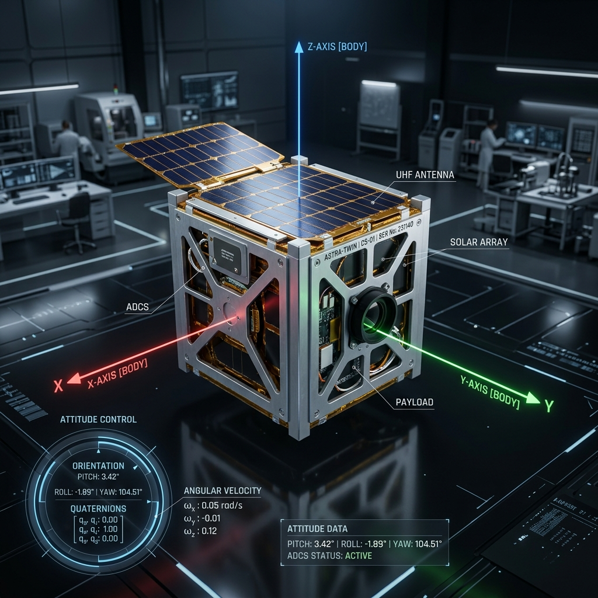
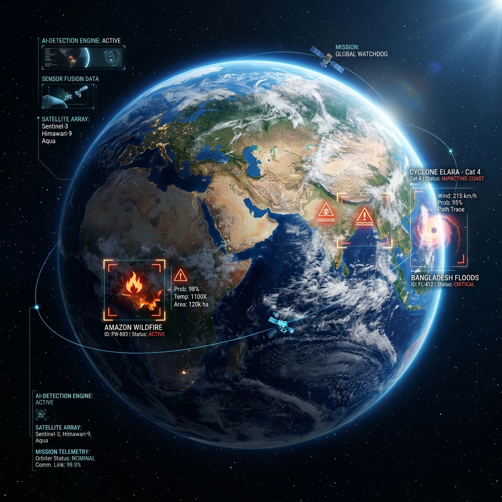
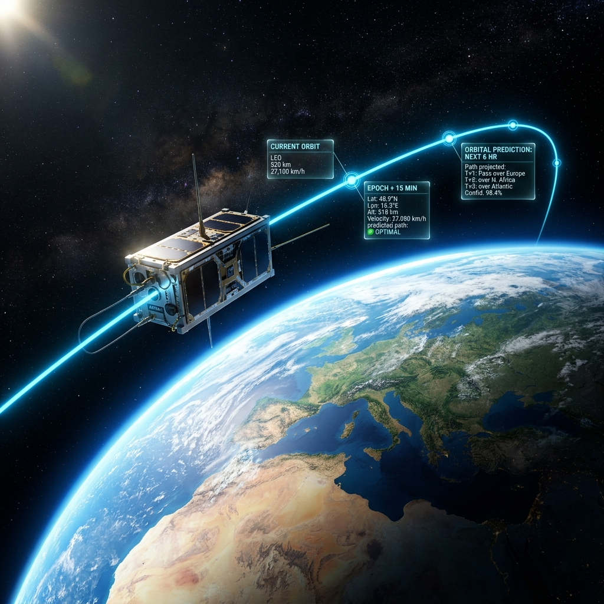
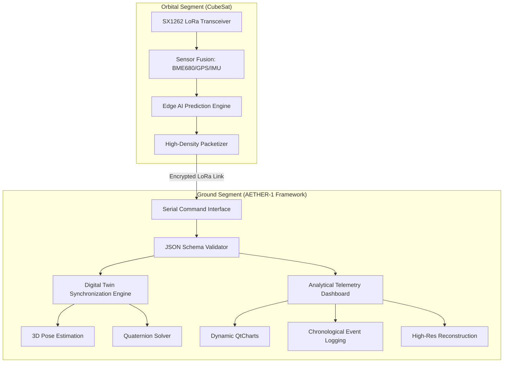

<div align="center">



# 🛰️ AETHER-1: High-Fidelity Digital Twin Framework
### Next-Generation CubeSat Telemetry Synchronization & AI-Driven Disaster Intelligence

[](https://opensource.org/licenses/MIT)
[](https://isocpp.org/)
[](https://www.qt.io/)
[]()

**AETHER-1** is a sophisticated, enterprise-grade Digital Twin framework engineered for the next generation of CubeSat missions. It establishes a seamless bridge between raw orbital telemetry and actionable ground-level intelligence through high-fidelity 3D state replication and edge-computed AI anomaly detection.

[Features](#-key-features) • [Mission Control](#-mission-control-interface) • [Neural Intelligence](#-neural-intelligence--ai-effects) • [Architecture](#-system-architecture) • [Tech Stack](#-tech-stack) • [Getting Started](#-getting-started)

</div>

---

## 📽️ Mission Control Interface

AETHER-1 delivers an executive-level analytical environment, transforming complex telemetry streams into intuitive, real-time visualizations.

<div align="center">
    <table style="width: 100%; border-collapse: collapse;">
        <tr>
            <td align="center" width="50%">
                <b>Advanced Telemetry Dashboard</b><br>
                
                <p><i>Real-time monitoring of LEO telemetry with sub-second latency.</i></p>
            </td>
            <td align="center" width="50%">
                <b>3D Digital Twin Sync</b><br>
                
                <p><i>High-fidelity 3D state replication mirroring orbital orientation.</i></p>
            </td>
        </tr>
    </table>
</div>

---

## 🧠 Neural Intelligence & AI Effects

The heart of AETHER-1 is its **Cognitive Processing Engine**, which utilizes advanced sensor fusion and onboard neural networks to predict disasters and optimize orbital health.

<div align="center">
    <table style="width: 100%; border-collapse: collapse;">
        <tr>
            <td align="center" width="33%">
                <b>Neural Processing Engine</b><br>
                
                <p><i>AI-driven data synthesis and packet analysis.</i></p>
            </td>
            <td align="center" width="33%">
                <b>Global Hazard Monitoring</b><br>
                
                <p><i>Real-time disaster hotspot detection from orbit.</i></p>
            </td>
            <td align="center" width="33%">
                <b>Orbital State Prediction</b><br>
                
                <p><i>AI-modeled trajectory and state forecasting.</i></p>
            </td>
        </tr>
    </table>
</div>

### 🤖 AI Capabilities:
*   **Predictive Anomaly Detection**: Identifies hardware failures or environmental shifts before they occur.
*   **Intelligent Disaster Mapping**: Correlates atmospheric sensors (BME680) with GPS data to pinpoint hazard zones.
*   **Autonomous State Correction**: Provides telemetry-driven recommendations for satellite attitude adjustments.

---

## 🚀 Project Overview

AETHER-1 provides a unified ground station command center capable of handling high-velocity telemetry from Low Earth Orbit (LEO) satellites. By leveraging a **Digital Twin** architecture, the system maintains a persistent, virtual mirror of the satellite's physical state, enabling operators to predict mission outcomes and mitigate risks before they manifest.

### Core Objectives:
*   **Precision State Mapping**: Instantaneous synchronization of 3D orientation (Pitch, Roll, Yaw) using advanced quaternion-based rotation.
*   **Predictive Health Monitoring**: Automated environmental analysis (Temperature, AQI, Gas) to ensure mission sustainability.
*   **Cognitive Disaster Intelligence**: Integrated neural models designed to identify ground-level anomalies in real-time.
*   **Robust LoRa Integration**: Native support for SX1262 LoRa radio protocols for long-range reliability.

---

## 🏗️ System Architecture

The AETHER-1 pipeline is designed for maximum throughput, moving data from edge ingestion to glassmorphism-based visualization.



---

## ✨ Key Features

| Feature | Description |
| :--- | :--- |
| **🌐 Ultra-Low Latency** | Real-time ingestion and validation of battery cycles and multi-sensor data. |
| **🧊 Kinetic Digital Twin** | A high-fidelity 3D representation that mirrors real-world physical orientation with precision. |
| **🤖 Neural Hazard Detection** | Real-time state classification powered by onboard AI disaster prediction models. |
| **📊 Advanced Analytics** | Interactive, glassmorphism-themed dashboards for monitoring mission trends. |
| **🖼️ Tile-Based Downlink** | Efficient image reconstruction system optimized for low-bandwidth satellite links. |
| **💾 Mission Critical Logging** | Automated CSV/JSON data archival for post-mission forensic analysis. |

---

## 🛠️ Specialized Engineering Skillset

<div align="left">
    <table style="width: 100%; border-collapse: collapse;">
        <tr>
            <td width="50%">
                <b>🚀 Aerospace Systems Engineering</b><br>
                - Digital Twin State Synchronization<br>
                - Orbital Dynamics & Orientation Modeling
            </td>
            <td width="50%">
                <b>💻 Advanced C++ Development</b><br>
                - Qt6 Professional Framework Usage<br>
                - High-Performance 3D Rendering (Qt3D)
            </td>
        </tr>
        <tr>
            <td width="50%">
                <b>🤖 Artificial Intelligence</b><br>
                - Edge-Based Anomaly Detection<br>
                - Mission-Critical Predictive Modeling
            </td>
            <td width="50%">
                <b>📡 Embedded Communication</b><br>
                - LoRa SX1262 PHY Layer Implementation<br>
                - Serial/UART Protocol Optimization
            </td>
        </tr>
    </table>
</div>

---

## ⚙️ Getting Started

### Prerequisites
*   Qt 6.x (Modules: **Qt Charts**, **Qt 3D**, **Qt SerialPort**)
*   C++17 Compliant Compiler
*   CMake 3.16 or higher

### Installation & Deployment
1. **Clone the Mission Repository**:
   ```bash
   git clone https://github.com/abhiramvsmg/AETHER-1-Digital-Twin-CubeSat-Telemetry.git
   cd AETHER-1-Digital-Twin-CubeSat-Telemetry
   ```
2. **Configure & Build**:
   ```bash
   mkdir build && cd build
   cmake .. -DCMAKE_BUILD_TYPE=Release
   cmake --build . --parallel 4
   ```

---

<div align="center">

**Developed with precision by [Abhiram V](https://github.com/abhiramvsmg)**

*"Advancing the frontier of satellite intelligence through high-fidelity digital synchronization."*

</div>
